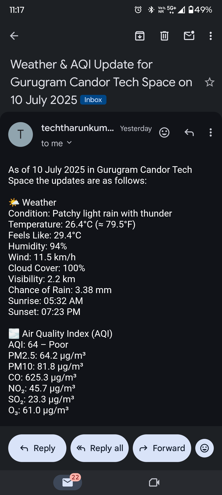

# automated-weather-report-generator
# 📬 Daily Weather & AQI Email Bot

Automatically sends you a daily weather and air quality report by email every morning at **8:00 AM IST**.

Perfect for:
- Tracking your local **weather, temperature, AQI, sunrise/sunset** daily
- Learning **GitHub Actions**, Python scripting, and free cloud automation
- Showcasing a real-world automation project in your GitHub portfolio

---

## 📦 Features
- 🌤 **Current weather** (description, temp, min/max)
- 💨 **AQI** (Air Quality Index)
- 🌅 **Sunrise/Sunset** timings
- 🕗 **Scheduled daily at 8 AM IST** using GitHub Actions
- 📧 Sends a **text email** directly to your inbox

---

## 🧰 Technologies Used
- Python 3.10
- GitHub Actions (cron job)
- OpenWeatherMap API (free tier)
- SMTP (Gmail) to send email

---

## 🔧 Setup Instructions

### 1. Fork or Clone the Repo
```bash
git clone https://github.com/tharunerd/automated-weather-report-generator.git

change the location co-ordinations in the main.py file according to your desired location
```

### 2. Add GitHub Secrets
Go to `Settings > Secrets > Actions` in your GitHub repository and add the following secrets:

| Name                | Value Description                    |
|---------------------|--------------------------------------|
| `OPENWEATHER_API_KEY` | Get it from https://openweathermap.org/api |
| `EMAIL`              | Your Gmail address                  |
| `EMAIL_PASS`         | Gmail App Password (not regular password) |
| `RECIPIENT`          | Your recipient email address        |

📌 **Note:** For Gmail, enable 2FA and generate an **App Password** [here](https://myaccount.google.com/apppasswords)

---

## 📁 Project Structure
```text
.
├── main.py                         # Fetches data and sends email
├── .github/workflows/schedule.yml  # GitHub Actions workflow
├── .env                            # For local testing (not pushed)
└── .gitignore                      # include the .env file
```

---

## 📬 Sample Email
```

🌤️ Weather
Condition: Mist
Temperature: 29.1°C (≈ 84.4°F)
Feels Like: 33.2°C
Humidity: 89%
Wind: 14.8 km/h
Cloud Cover: 75%
Visibility: 3.0 km
Chance of Rain: 1.2 mm
Sunrise: 05:43 AM
Sunset: 07:14 PM

🌫️ Air Quality Index (AQI)
AQI: 62 – Poor
PM2.5: 62.0 µg/m³
PM10: 62.0 µg/m³
CO: 727.0 µg/m³
NO₂: 39.0 µg/m³
SO₂: 32.2 µg/m³
O₃: 65.0 µg/m³
```

---

## 🌍 Credits
Made with ❤️ by [Tharun Kumar Akula](https://github.com/tharunerd)

Data provided by:
- [OpenWeatherMap](https://openweathermap.org/)

---

## 📌 License
This project is licensed under the [MIT License](LICENSE).

Feel free to fork and improve! Pull requests welcome.
